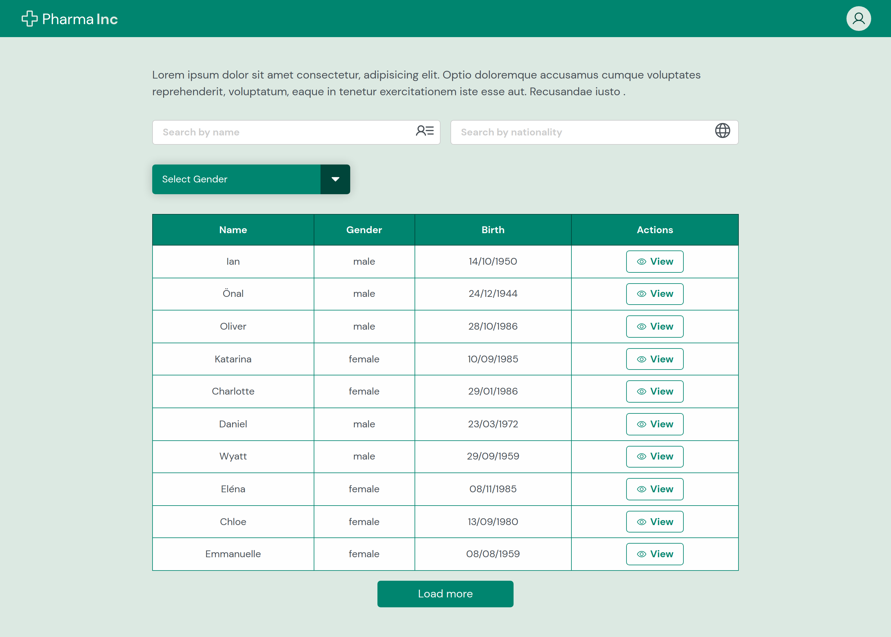
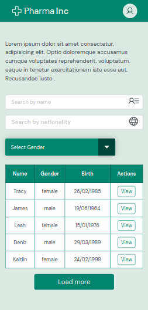
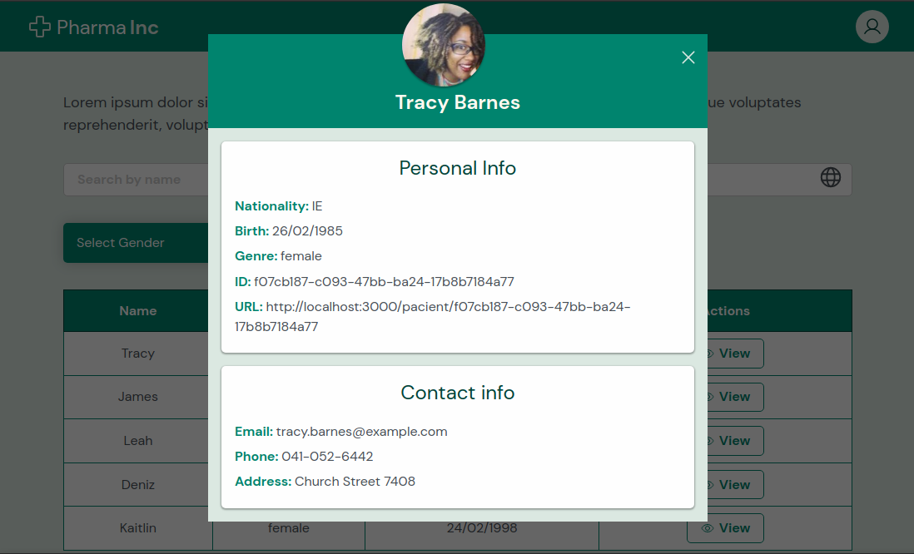
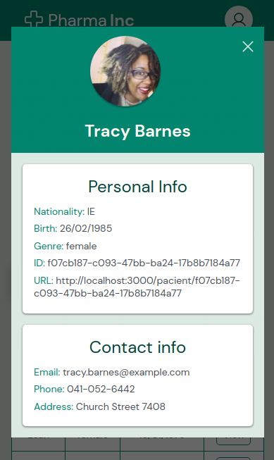

# Pharma Inc. - Challenge by Coodesh

Desafio desenvolvido com o objetivo de avaliar minha forma de estruturação e autonomia em decisões para construir algo escalável, utilizando um framework moderno Javascript.

# Sumário

- [case](#case)
- [Funcionalidades](#funcionalidades)
- [Tecnologias utilizadas](#tecnologias)
- [Instruções para rodar o projeto](#instrucoes)
- [Organização e estruturação do projeto](#organizacao)
- [Desenvolvimento](#desenvolvimento)
- [Resultado](#resultado)

# Case <a name="case"></a>

A empresa Pharma Inc, está trabalhando em um projeto em colaboração com sua base de clientes para facilitar a gestão e visualização da informação dos seus pacientes de maneira simples e objetiva em um Dashboard onde podem listar, filtrar e expandir os dados disponíveis.
O seu objetivo nesse projeto, é trabalhar no desenvolvimento do Front end que consumirá a API da empresa Pharma Inc seguindo os requisitos propostos neste desafio.

# Funcionalidades <a name="funcionalidades"></a>

- [x] **Lista de Pacientes**: Listar os pacientes com o uso da Api <a href="https://randomuser.me/">Random User</a>.
- [x] **Estado global**: O resultado da API deve ser armazenado em um estado global. (Pode ser utilizado Redux, Context, Vuex ou tecnologia equivalente do framework utilizado)
- [x] **Limitar requisições**: Limitar cada requisição da página em 50 resultados para não sobrecarregar a API.
- [x] **Paginação**: Adicionar o parâmetro de paginação para controlar o `Loading more`
- [x] **Botão View**: botão view para abrir o modal com as informações do paciente.
- [x] **Filtro**: Adicionar um filtro por Gênero na tabela.
- [x] **Buscador**: Configurar o buscador para poder filtrar por nome e nacionalidade.
- [ ] **URL para compartilhar paciente**: Ao acessar a aplicação diretamente por essa URL a aplicação deve abrir o modal com as informações do paciente.
- [ ] **Testes** Escrever Unit Tests ou E2E Test na Lista de Pacientes. Escolher a melhor abordagem e biblioteca;
- [ ] **Docker** Configurar Docker no Projeto para facilitar o Deploy da equipe de DevOps;
- [x] **Layout responsivo**

# Tecnologias Utilizadas <a name="tecnologias"></a>

- [**React**](https://pt-br.reactjs.org/)
- [**React Hooks**](https://pt-br.reactjs.org/docs/hooks-intro.html)
- [**React Router Dom**](https://www.npmjs.com/package/react-router-dom)
- [**Styled Components**](https://styled-components.com/)
- [**Phosphor Icons**](https://phosphoricons.com/)
- [**Axios**](https://axios-http.com/docs/intro)

# Instruções para rodar o projeto <a name="instrucoes"></a>

### Será necessário ter instalado na sua máquina:

```
Git
React
Node v6.0.0^
```

- Clone o repositório com o comando **git clone**:

```
git clone ----
```

- Entre no diretório que acabou de ser criado:

```
cd forever-baby
```

- Para o projeto funcionar na sua máquina, será necessário instalar suas dependências, para isso, utilize o comando **npm install**:

```
npm install
```

- Pronto, agora o projeto está pronto para ser rodado localmente, utilizando o comando **npm start**:

```
npm start
```

# Organização e estruturação do projeto <a name="organizacao"></a>

O projeto está organizado e estruturado da seguinte forma:

```
      ├── README.md
      ├── index.html
      ├── src
      |     ├── components
      |     |       ├── Header
      |     |       |     ├── index.jsx
      |     |       |     ├── styles.js
      |     |       ├── Modal
      |     |       |     ├── index.jsx
      |     |       |     ├── styles.js
      |     |       ├── PersonalContact
      |     |       |     ├── index.jsx
      |     |       |     ├── styles.js
      |     |       ├── PersonalInfo
      |     |       |     ├── index.jsx
      |     |       |     ├── ItemCard.jsx
      |     |       ├── SearchName
      |     |       |     ├── index.jsx
      |     |       |     ├── styles.js
      |     |       ├── SearchNat
      |     |       |     ├── index.jsx
      |     |       |     ├── styles.js
      |     |       ├── Table
      |     |       |     ├── index.jsx
      |     |       |     ├── Tr.jsx
      |     |       |     ├── styles.js
      |     ├── contexts
      |     |       ├── UserContext.jsx
      |     ├── helpers
      |     |       ├── Loading
      |     |       |     ├── index.jsx
      |     |       |     ├── styles.js
      |     ├── hooks
      |     |       ├── useUsers.js
      |     ├── pages
      |     |       ├── Home
      |     |       |     ├── index.jsx
      |     |       |     ├── styles.js
      |     ├── services
      |     |       ├── api.js
      |     ├── styles
      |     |       ├── global.js
      |     ├── App.jsx
      |     ├── main.jsx
```

# Desenvolvimento <a name="desenvolvimento" ></a>

## Fetch

Para realizar o fetch no banco de dados da API, foi utilizado o client HTTP [**Axios**](https://axios-http.com/docs/intro).

## Estilização

Para realizar a estilização, foi utilizado o framework [**Styled Components**](https://styled-components.com/).

## Icones

Os ícones utilizados foram os da biblioteca [**Phosphor Icons**](https://phosphoricons.com/)

# Resultado <a name="resultado"></a>

## Lista de Pacientes

A tela inicial do projeto será uma lista de pacientes que deverá conter um buscador para facilitar filtrar todos os que são exibidos na lista.
Na coluna de ações da tabela, existe o botão View para expandir os dados dos pacientes.



- Responsivo



## Modal

Modal com Informações do paciente.



- Responsivo



## 🦄 Autor<br>

<table>
  <tr>
    <td align="center">
      <a href="https://github.com/Flaviane-Brum">
        <br>
        <sub>
          <b>Flaviane Brum</b>
        </sub>
      </a>
    </td>
  </tr>
</table>
